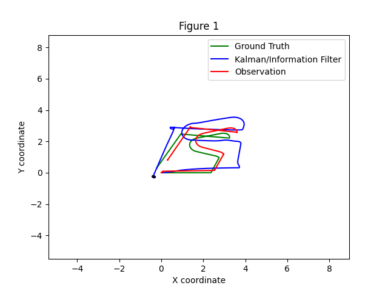
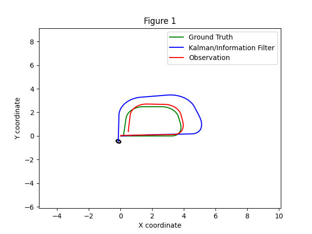
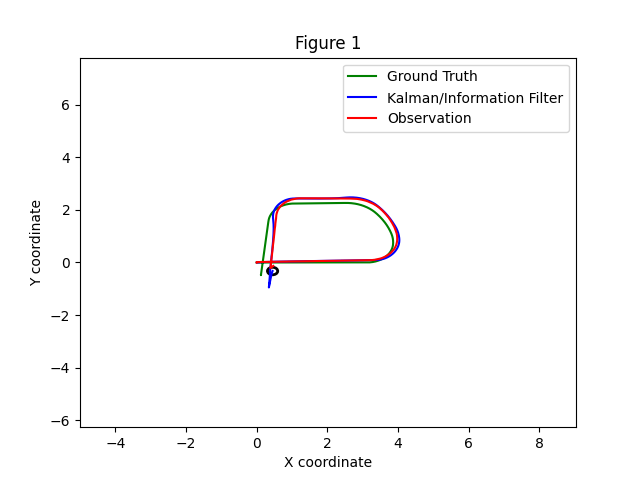
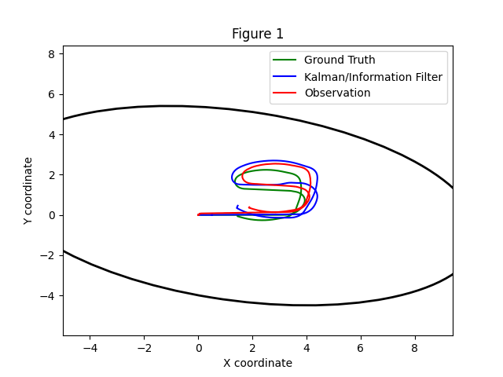
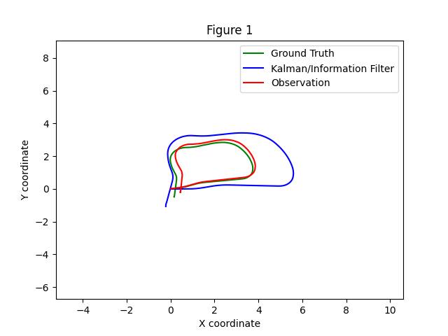
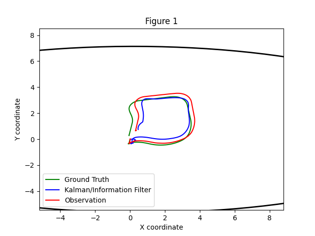
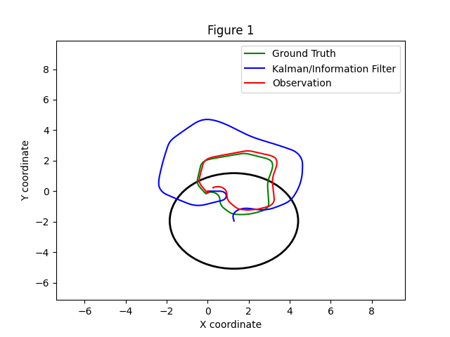
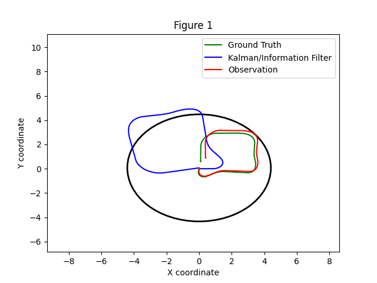
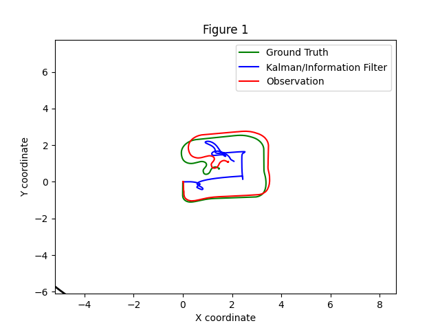

# p3_adr_ill

## Descripción general
Este paquete de ROS2 implementa filtros de Kalman extendidos (EKF) en variantes de 3D, 7D y 8D para Turtlebot3 en Gazebo, permitiendo comparar distintos modelos.

## Características
- Versiones EKF en 3D, 7D y 8D  
- Modelos de movimiento y observación intercambiables tipo "plug-and-play"

## Detalles

## Comparativa 3D base y con incremento de ruido en observación y modelo de movimiento
En todos los experimentos con ruido, se ha incrementado cada componente en un orden de magnitud.

### 3D base

### 3D con ruido en la observación

### 3D con ruido en el modelo de movimiento

El modelo 3D muestra un buen desempeño, especialmente en cuanto a la incertidumbre, que se mantiene con un radio muy reducido. Además, se observa que tanto en el caso base como con ruido en la observación, la diferencia entre el filtro/la observación y el "ground truth" es apreciable. Sin embargo, al añadir únicamente ruido al modelo de movimiento, las trayectorias de las tres mediciones se asemejan mucho más, ya que el filtro "aprende" más rápido y se ajusta mejor.

### 7D base

### 7D con ruido en la observación

### 7D con ruido en el modelo de movimiento

En el caso 7D, donde se incluyen velocidades y aceleración lineal, la predicción suele ser bastante cercana a la posición real, salvo cuando se incrementa el ruido en la observación, donde la diferencia es mayor. El efecto del ruido se aprecia especialmente en la incertidumbre (elipse negra): en el caso base es de tamaño medio (posiblemente mejorable), con ruido en el modelo de movimiento aumenta notablemente y, finalmente, con ruido en la observación es tan grande que sobrepasa la gráfica.

### 8D base

### 8D con ruido en la observación

### 8D con ruido en el modelo de movimiento

Por último, en el modelo 8D, donde se consideran por separado las componentes x e y de la velocidad lineal, el filtro presenta un comportamiento algo peculiar:
- En el caso base, la incertidumbre es aceptable, pero la predicción se desvía notablemente del "ground truth".
- Al aumentar el ruido en la observación, la incertidumbre se mantiene, pero la predicción es deficiente, principalmente porque aparece rotada unos 90º respecto al "ground truth".
- Con más ruido en el modelo de movimiento, la predicción sigue siendo diferente, pero lo más llamativo es que la incertidumbre se vuelve excesivamente grande.
